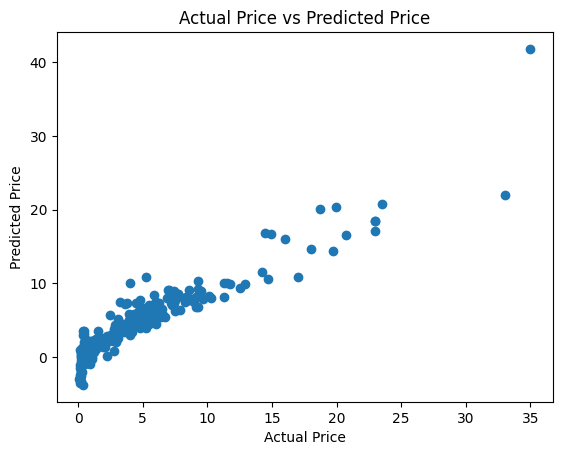

# Car Price Prediction using Linear Regression

This repository contains code for predicting car prices using machine learning techniques.

## Overview

Predicting car prices is a common problem in the automotive industry, and machine learning models can help automate this process by analyzing various factors such as mileage, age, brand, and more. This repository provides a Jupyter Notebook that demonstrates how to build and evaluate a machine learning model for predicting car prices based on a given set of features.

## Dependencies

To run the code in this repository, you'll need the following dependencies:

- Jupyter Notebook
- scikit-learn
- pandas
- matplotlib
- seaborn

## Plot and its Meaning

The repository includes a plot showing the relationship between the actual prices and predicted prices of cars using linear regression. This plot helps visualize how well the model performs in predicting car prices. Ideally, the points should fall close to the diagonal line, indicating a strong correlation between the actual and predicted prices.

## Source of Dataset

The dataset used for this project is sourced from the Kaggle dataset repository. The dataset contains information about various car attributes such as mileage, age, brand, and price.

- **Dataset Source**: Kaggle
- **Dataset Link**: [Car Price Dataset](https://www.kaggle.com/datasets/nehalbirla/vehicle-dataset-from-cardekho)

## Contributing

Contributions to this project are welcome! If you find any issues or have suggestions for improvement, please feel free to open an issue or submit a pull request.

